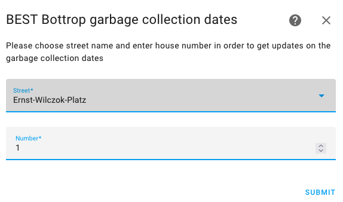

# Garbage Collection Dates - City of Bottrop (DE)
[](https://github.com/hacs/integration)

Home Assistant Component for BEST Bottrop Garbage Collection Dates

This is a custom component for [Homeassistant](https://www.home-assistant.io/). 
It will fetch garbage collection dates for the city of [Bottrop] (https://www.bottrop.de/) provided by the municipal waste disposal service [BEST] (https://www.best-bottrop.de/)
It will create sensors for your configured address that will show the next garbage collection dates for the trash types and how many days are left for the next collection. You can add those sensors to your automation our build up cards/dashboards in lovelace.

You can - of course - use the calender function of HA for recurrend events. But this integration is more flexible. You won't need to update your calendar anymore - and it will update automatically when special events occure like strikes etc.

Please note that this will only work for the city of [Bottrop in Germany](https://de.wikipedia.org/wiki/Bottrop). No other city is supported!

## Installation
1. Use [hacs](https://custom-components.github.io/hacs/) with this repo URL https://github.com/Nazze/ha_best_bottrop_garbage_collection to your HACS configuration.
2. Add integration from HACS
3. Restart Homeassistant

## Configuration

5. Go to "Settings" and "Devices and Services"
6. Hit "Add Integration"
   

   
7. Chose "BEST Bottrop garbage collection dates"


8. Configure your address



9. The integration will add the entities


The state means "days until collection", and the attributes will provide you with additional data.

## Lovelace-Example

You can now create beatiful dashboards for your collection.


Requires: [auto-entities](https://github.com/thomasloven/lovelace-auto-entities) and [mushroom-cards](https://github.com/piitaya/lovelace-mushroom)
Replace "sensor.ernst*" with your wildcarded street

```
type: vertical-stack
title: Müllabfuhr
cards:
  - type: custom:auto-entities
    card:
      type: entities
    filter:
      include:
        - entity_id: sensor.ernst*
          options:
            type: custom:mushroom-template-card
            primary: |
              {{ states.this.entity_id.attributes.friendly_name }}
            secondary: >
               Morgen   Heute    In {{
              states.this.entity_id.state }} Tagen  ({{
              as_timestamp(states.this.entity_id.attributes.next_date)|timestamp_custom("%d.%m.%Y")}})
            icon: |
              {{ states.this.entity_id.attributes.icon }}
            icon_color: >
               red 
              brown  yellow  blue  grey 
            tap_action:
              action: call-service
              service: best_bottrop_garbage_collection.ignore
              service_data:
                days: 2
              target:
                entity_id: this.entity_id
      exclude:
        - state: None
        - state: unknown
        - state: '> 7'
      sort:
        method: state
        numeric: true
    sort:
      method: state
      numeric: true

```

Double click on a garbage entity will ignore the collection for this trash type for 2 days.


## Services

Services will help you to ignore a garbage entity for the next defined days (because you brought out the garbage bin). The above Lovelace example makes use of this.
If you want to manually set it or reset it, you can go to

1. Developer Tools
2. Services
3. Select Service "BEST Bottrop garbage collection dates: ignore"
4. Select the entity or multiple entities
5. Define, how many days this sensor should be ignored (optional, default = 2, max=365, reset = 0)


